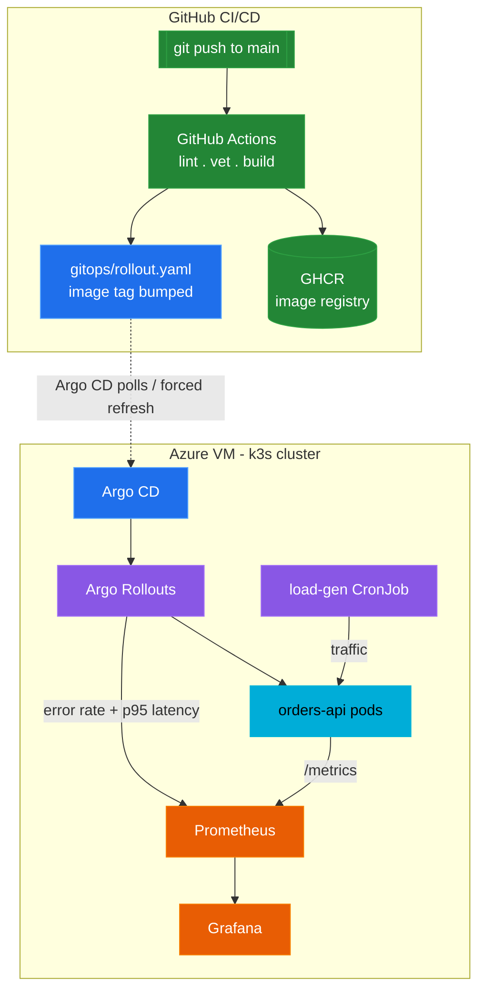
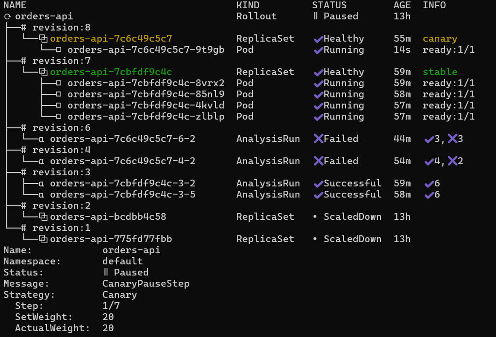
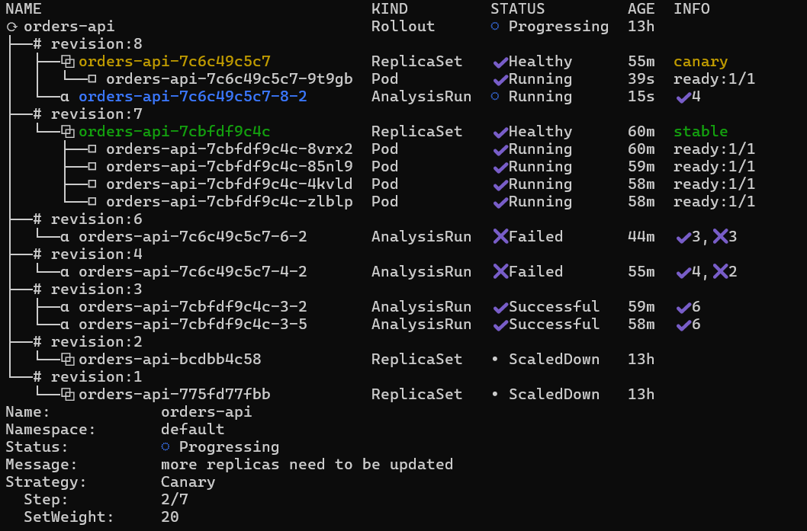
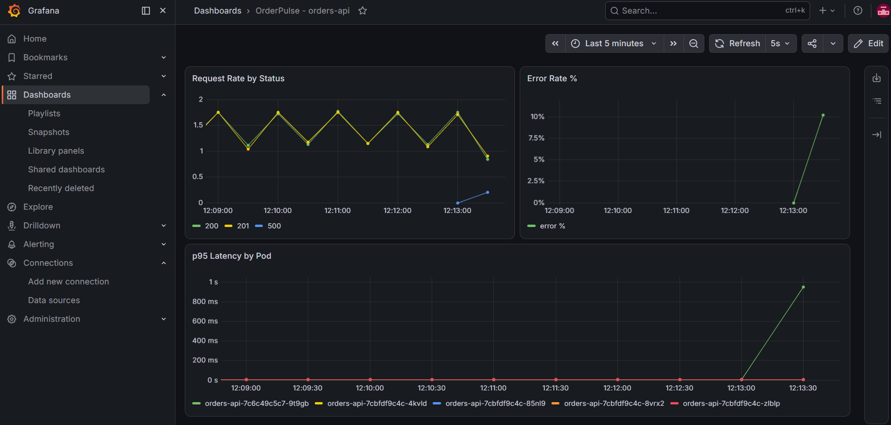
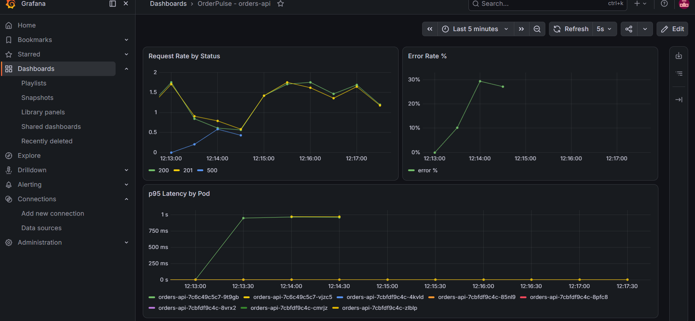
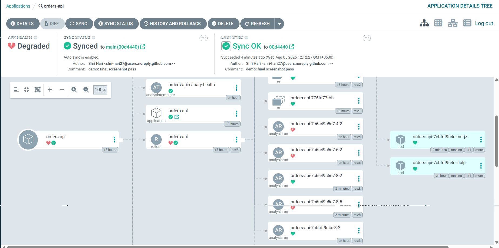
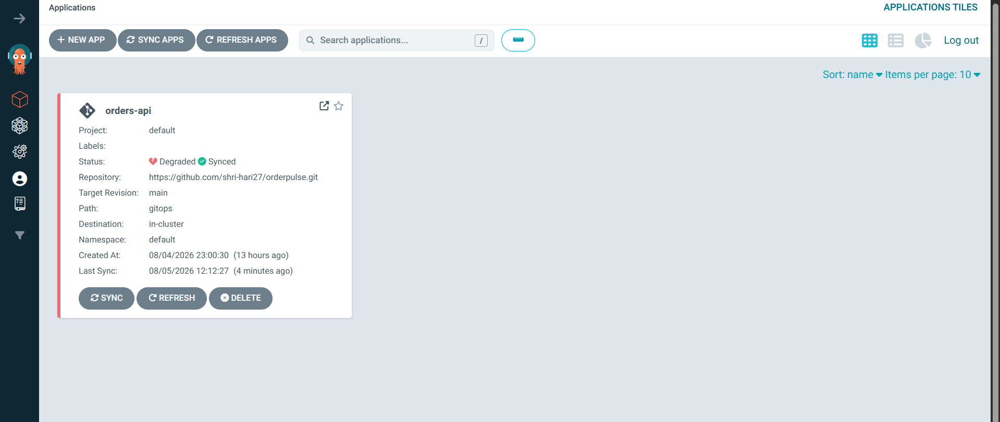
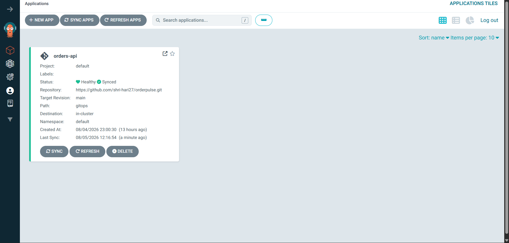
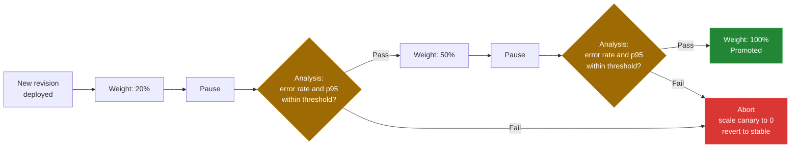

# OrderPulse


[](https://github.com/shri-hari27/orderpulse/actions/workflows/ci.yml)

GitOps-driven progressive delivery for an order-processing service: canary
releases gated on live Prometheus metrics, with fully automated rollback on
regression, and a designed (not live-wired) AI-assisted incident-triage step.

## Contents
- [What this demonstrates](#what-this-demonstrates)
- [Architecture](#architecture)
- [Screenshots](#screenshots)
- [How the canary analysis works](#how-the-canary-analysis-works)
- [Proven, not just designed](#proven-not-just-designed)
- [Monitoring](#monitoring)
- [AI-assisted development](#ai-assisted-development)
- [Repo structure](#repo-structure)
- [Reproducing the rollback locally](#reproducing-the-rollback-locally)
- [What I'd add with more time](#what-id-add-with-more-time)

## What this demonstrates

Most portfolio Kubernetes projects stop at "deployed an app to a cluster."
This one is about what happens next: shipping a change safely, watching it
prove itself against real traffic before it gets full rollout, and backing
off automatically the moment it doesn't. That is the core of what
**progressive delivery** and **canary analysis** mean in a real production
context — and this repo is a working, tested implementation of it, not a
diagram.

## Architecture



**Component choices:** single Azure VM + Terraform (no AKS) - control-plane
cost/ops tradeoff at this scale. k3s over kubeadm - same reasoning, minimal
footprint for a single node. Argo Rollouts on top of Argo CD (not a
separate tool) - the actual mechanism for canary analysis, not just sync.
kube-prometheus-stack - Prometheus, Grafana, and Alertmanager wired
together with the CRDs the AnalysisTemplate depends on.

## Screenshots

<table>
<tr>
<td width="50%">

**1. Canary paused at 20%**

Argo Rollouts holds the new revision at 20% traffic before the analysis gate runs.

</td>
<td width="50%">

**2. Analysis querying Prometheus**

Live error-rate and latency queries evaluated against real traffic, mid-check.

</td>
</tr>
<tr>
<td width="50%">

**3. Metrics spike on the bad revision**

Error rate and p95 latency break from baseline the moment the canary takes traffic.

</td>
<td width="50%">

**4. Clearer view of the spike**

Error rate near 30%, p95 latency pinned near 1s - both past threshold.

</td>
</tr>
<tr>
<td width="50%">

**5. Argo CD tree after the abort**

AnalysisRuns marked Failed; canary already scaled to zero.

</td>
<td width="50%">

**6. Application state: Degraded**

No human ran `kubectl rollout undo` - this is the automated result.

</td>
</tr>
<tr>
<td colspan="2" align="center">

**7. Recovered: Healthy and Synced**



*After reverting the injected failure, the next rollout passes both gates and promotes cleanly.*

</td>
</tr>
</table>

## How the canary analysis works



Each analysis step (`gitops/analysistemplate.yaml`) queries Prometheus
directly for two live signals on `/orders`: **error rate** (5xx / total) and
**p95 latency**. If either breaches its threshold across the sampled
window, Argo Rollouts aborts automatically and reverts traffic to the last
known-good revision - no human runs `kubectl rollout undo`.

## Proven, not just designed

This was tested live against the running cluster, not just written:

| Test | Result | Evidence |
|---|---|---|
| **Automated abort** - injected `FAIL_RATE=0.6` | Canary reached 20%, p95-latency analysis failed 2/3 windows, Rollouts aborted automatically, full revert to stable | `docs/example-incident-summary.md`, screenshots 3-6 |
| **Clean promotion** - reverted the failure | Canary passed both analysis gates, promoted cleanly to 100% | screenshot 7 |

## Monitoring

- `gitops/servicemonitor.yaml` - Prometheus scrape config for orders-api
- `gitops/prometheusrule.yaml` - 3 alert rules: high error rate, high
  latency, and target-down (a distinct failure mode a latency/error alert
  alone would miss entirely)
- `monitoring/grafana-dashboard.json` - request rate by status, error rate
  %, and p95 latency broken out by pod (so a canary pod's degradation is
  visible separately from stable pods during a rollout)

## AI-assisted development

- `orders-api`'s application code was AI-generated end to end; engineering
  effort on this project went entirely into the DevOps/infra/delivery
  layer, not the app logic.
- `scripts/rollout-watcher.py` is a designed-and-committed (not live-wired)
  incident-triage automation: on a real abort, it would gather the Rollout
  status message, AnalysisRun results, and recent pod logs, send them to
  the Claude API, and file the returned summary as a GitHub Issue
  automatically. Left unwired in this build deliberately, to avoid a paid
  API dependency for a time-boxed portfolio project - see
  `docs/example-incident-summary.md` for a representative example of its
  output against this project's real abort data.

## Repo structure

```
orderpulse/
├── app/                  orders-api (Go), Dockerfile
├── gitops/               Argo CD Application, Rollout, Service,
│                         AnalysisTemplate, ServiceMonitor, PrometheusRule,
│                         load-gen CronJob
├── infra/                Terraform: VM, network, NSG, cloud-init
├── monitoring/           kube-prometheus-stack values, Grafana dashboard
├── scripts/              AI incident-triage watcher (design, unwired)
├── docs/                 screenshots, example incident summary
└── .github/workflows/    CI: build, vet, push to GHCR, bump gitops tag
```

## Reproducing the rollback locally

1. Edit `gitops/rollout.yaml`, add `FAIL_RATE: "0.6"` as an env var on the
   `orders-api` container.
2. Commit and push. Argo CD picks it up automatically.
3. Watch: `kubectl argo rollouts get rollout orders-api --watch`
4. Observe the canary abort at the analysis gate and full automatic revert
   to stable.
5. Remove the env var, commit, push - watch a clean promotion instead.

## What I'd add with more time

- Split `app/` and `gitops/` into separate repos with a real deploy-key
  boundary, closer to actual app-team/platform-team separation.
- A second service, so the canary story includes a cross-service failure
  mode, not just a single service's own regression.
- Remote-write Prometheus storage so metrics history survives VM teardown.
- SLO-based error budgets/burn-rate alerts instead of static thresholds.
- Wire `scripts/rollout-watcher.py` to a live, billed API key and run it as
  an in-cluster CronJob rather than host cron.
- Bring back a DevSecOps layer (image scanning, signing) as a deliberate
  follow-on, once the delivery mechanics were already proven solid.

## Notes on constraints

Built in a hard time/cost budget: single Azure VM, no AKS, no service mesh,
no DevSecOps tooling - all deliberate scope decisions to keep effort
focused on progressive delivery and observability, the actual point of the
project, documented above rather than treated as unexplained omissions.
